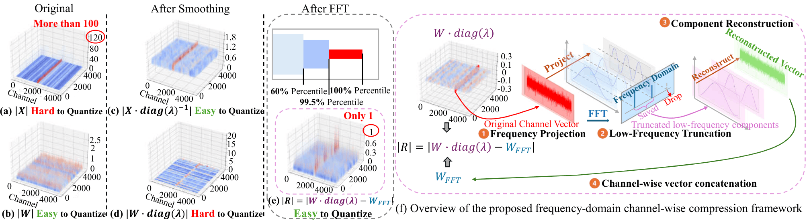
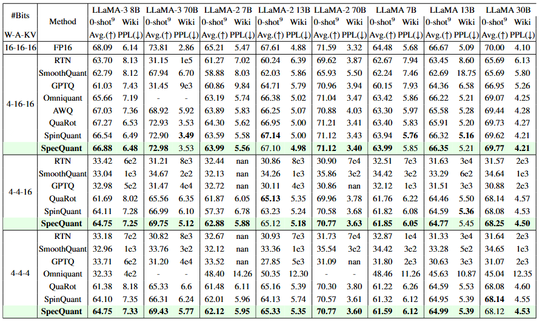

<div align="center">

# [AAAI'26] SpecQuant: Spectral Decomposition and Adaptive Truncation for Ultra-Low-Bit LLMs Quantization

[Zhixiong Zhao](https://kishon-zzx.github.io/)\*, Fangxin Liu\*, Junjie Wang, Chenyang Guan, Zongwu Wang, Li Jiang, and Haibing Guan

<br>

<a href="https://arxiv.org/abs/2511.11663" target="_blank">
</a>

<a href="https://github.com/Kishon-zzx/SpecQuant" target="_blank">
</a>

</div>

---

> **Abstract:** The emergence of accurate open large language models (LLMs) has sparked a push for advanced quantization techniques to enable efficient deployment on end-user devices. In this paper, we revisit the challenge of extreme LLM compression---targeting ultra-low-bit quantization for both activations and weights---from a Fourier frequency domain perspective. We propose SpecQuant, a two-stage framework that tackles activation outliers and cross-channel variance. In the first stage, activation outliers are smoothed and transferred into the weight matrix to simplify downstream quantization. In the second stage, we apply channel-wise low-frequency Fourier truncation to suppress high-frequency components while preserving essential signal energy, improving quantization robustness. Our method builds on the principle that most of the weight energy is concentrated in low-frequency components, which can be retained with minimal impact on model accuracy. To enable runtime adaptability, we introduce a lightweight truncation module during inference that adjusts truncation thresholds based on channel characteristics. On LLaMA-3 8B, SpecQuant achieves 4-bit quantization for both weights and activations, narrowing the zero-shot accuracy gap to only 1.5\% compared to full precision, while delivering 2× faster inference and 3× lower memory usage. Code will be available at https://github.com/Kishon-zzx/SpecQuant.




## 🔎 Results
<details>
<summary>SpecQuant achieves superior perplexity performance on WikiText2 datasets and superior average accuracy on 9 zero-shot QA datasets. (click to expand)</summary>

<p align="center">
  
</p>

</details>

## Citation

If you find the code helpful in your research or work, please cite the following paper.

```
@inproceedings{zhao2026specquant,
    title={Specquant: Spectral decomposition and adaptive truncation for ultra-low-bit llms quantization},
    author={Zhao, Zhixiong and Liu, Fangxin and Wang, Junjie and Guan, Chenyang and Wang, Zongwu and Jiang, Li and Guan, Haibing},
    booktitle={Proceedings of the AAAI Conference on Artificial Intelligence},
    volume={40},
    number={34},
    pages={28786--28794},
    year={2026}
  }
```